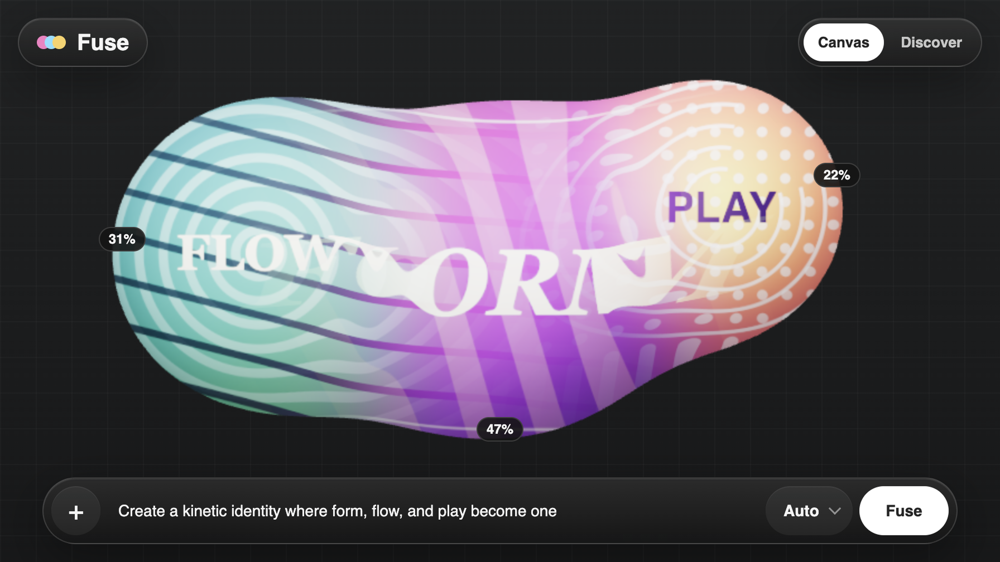
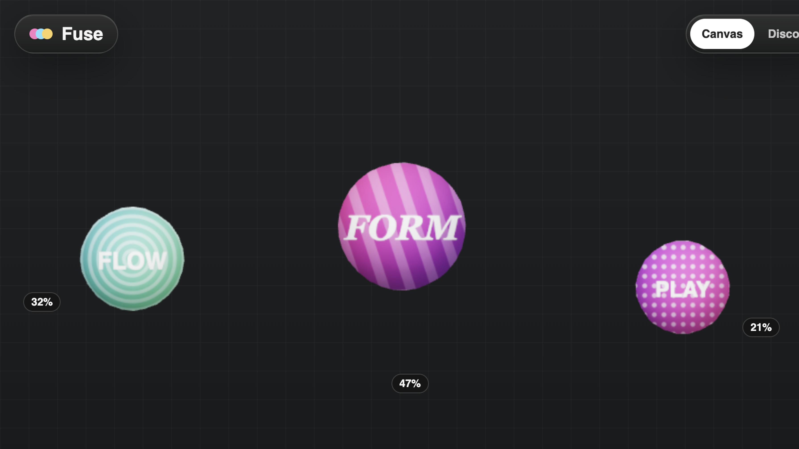
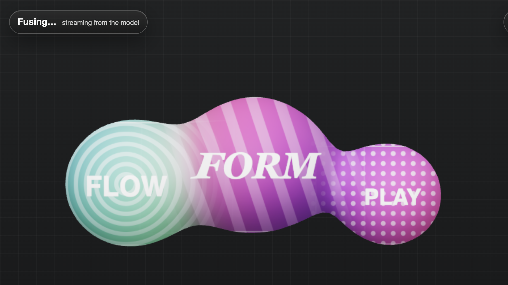
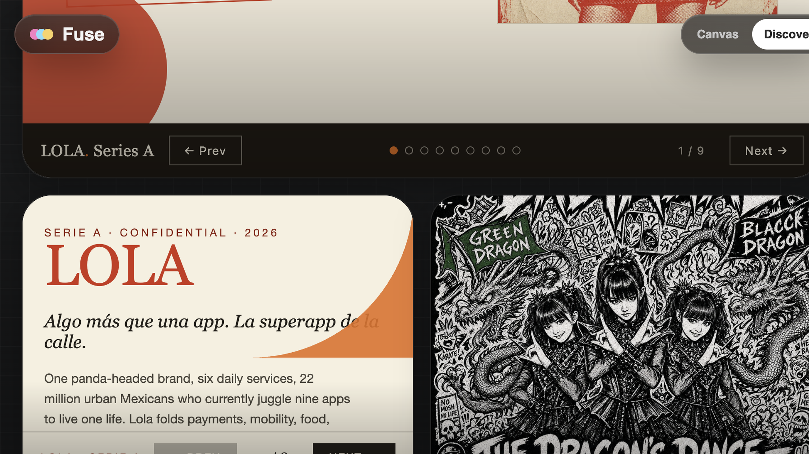
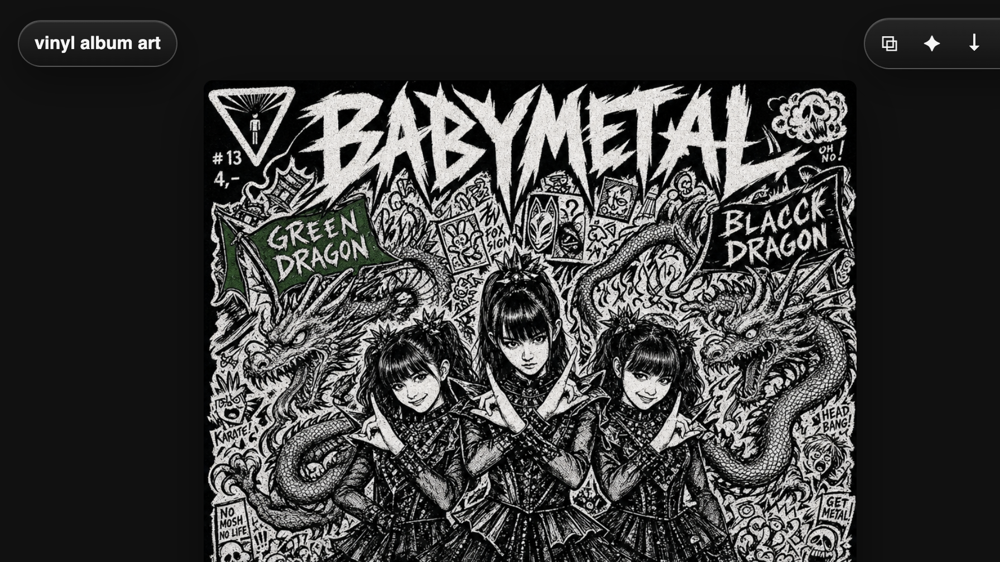

<!-- markdownlint-disable MD041 -->

<!-- 01 · What? / Value prop -->

`What?`

# Fuse

**Value prop.** A visual canvas that turns prompting from instruction writing into composition. Drop in text, images, or prior outputs, size each ingredient by influence, and Fuse streams them into one polished interactive artifact.

---

<!-- Product moment · Compose -->

<!-- _header: '' -->
<!-- _footer: '' -->
<!-- _paginate: false -->

---

<!-- 02 · Who? / User opportunity -->

`Who?`

## User opportunity

Creative knowledge workers combine documents, screenshots, references, and prior work every day. A prompt box flattens that intent into attachments plus prose, where relative importance is hard to express.

Fuse makes the brief direct: **these are the ingredients; this is how much each one matters.**

---

<!-- 03 · How? / AI's role -->

`How?`

## AI's role

Claude interprets the weighted composition and streams the right artifact live: a report, game, quiz, deck, story, or image.

The result stays in the loop: save it, share it, or remix it as a new ingredient.

---

<!-- Product moment · Fuse -->

<!-- _header: '' -->
<!-- _footer: '' -->
<!-- _paginate: false -->

---

<!-- 04 · Why us? / Microsoft fit -->

`Why us?`

## Microsoft fit

- **Copilot rich artifacts.** Move from chat answers to usable, interactive things.
- **Work IQ and Microsoft Graph.** Make files, meetings, images, and prior outputs first-class ingredients.
- **Enterprise artifact platform.** Persistence, sharing, reuse, provenance, and governance turn generation into a durable workflow.

---

<!-- Product moment · Discover -->

<!-- _header: '' -->
<!-- _footer: '' -->
<!-- _paginate: false -->

---

<!-- 05 · Why now? / Novelty -->

`Why now?`

## Novelty

**Why now.** Models can finally reason across mixed media, edit source pixels, generate executable interfaces, and stream useful structure live. The interaction model is still mostly a text box.

**Novelty.** Fuse makes relative intent visible and editable. Size expresses influence; ingredients behave as one composition; outputs become material for what comes next.

---

<!-- Product moment · Output -->

<!-- _header: '' -->
<!-- _footer: '' -->
<!-- _paginate: false -->

---

<!-- 06 · What kills it? / Risks -->

`What kills it?`

## Risks

- **No output lift.** If weighted composition performs no better than a short prompt, the interaction is theater.
- **Weak model obedience.** Ingredients may be ignored or blended too literally.
- **Metaphor confusion.** Motion must simplify intent, not imply hidden controls.
- **Trust and latency.** Rich output must be safe, correct, fast, and cost-aware.
